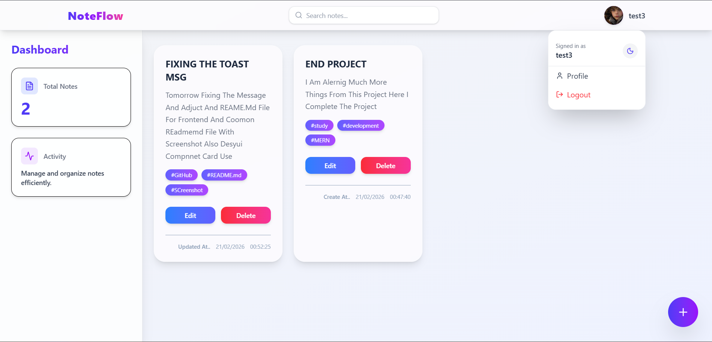
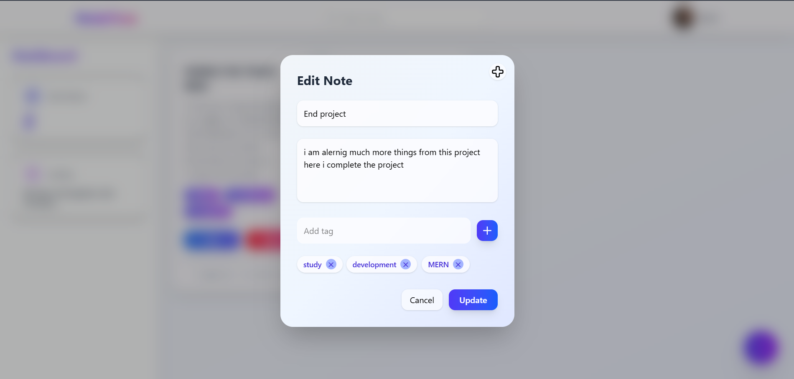
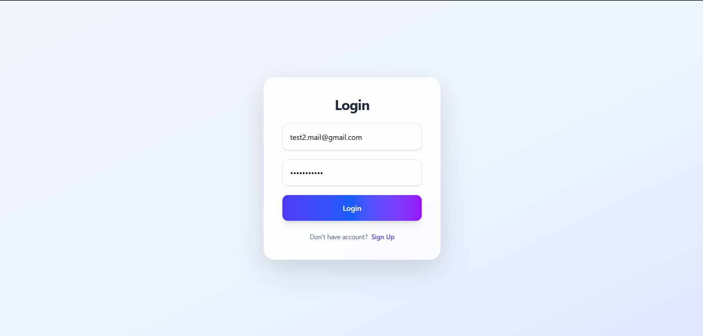

# Note App





A full-stack note-taking application that allows users to create, manage, and organize their personal notes securely. Built with modern web technologies, this app provides a seamless experience for note management with user authentication, tagging, search functionality, and theme customization.

## Features

### User Authentication

- **User Registration**: Create a new account with email and password
- **User Login**: Secure login with JWT authentication
- **User Logout**: Safe logout functionality
- **Profile Management**: View and edit user profile information

### Note Management

- **Create Notes**: Add new notes with title, content, and tags
- **Edit Notes**: Modify existing notes
- **Delete Notes**: Remove notes permanently
- **View All Notes**: Display all user notes in a dashboard
- **Tag System**: Organize notes with custom tags
- **Search Functionality**: Search notes by title or content
- **Filtering**: Filter notes based on tags or other criteria

### User Interface

- **Responsive Design**: Works on desktop, tablet, and mobile devices
- **Dark/Light Theme**: Toggle between dark and light modes
- **Intuitive Dashboard**: Clean and user-friendly interface
- **Modal Forms**: Smooth note creation and editing experience
- **Toast Notifications**: Real-time feedback for user actions

### Security

- **JWT Authentication**: Secure token-based authentication
- **Protected Routes**: Access control for authenticated users only
- **Password Security**: Proper password handling and validation
- **CORS Configuration**: Secure cross-origin resource sharing

## Tech Stack

### Frontend

- **React**: Component-based UI library
- **Redux**: State management for notes and user data
- **Vite**: Fast build tool and development server
- **Tailwind CSS**: Utility-first CSS framework for styling
- **React Router**: Client-side routing
- **Axios**: HTTP client for API calls
- **React Hot Toast**: Toast notifications
- **Framer Motion**: Animation library for smooth transitions
- **Lucide React**: Icon library

### Backend

- **Node.js**: JavaScript runtime
- **Express.js**: Web application framework
- **MongoDB**: NoSQL database for data storage
- **Mongoose**: ODM for MongoDB
- **JWT**: JSON Web Tokens for authentication
- **bcryptjs**: Password hashing
- **Cookie Parser**: Parse cookies for authentication
- **CORS**: Enable cross-origin requests

## Installation

### Prerequisites

- Node.js (v14 or higher)
- MongoDB (local or cloud instance)
- npm or yarn package manager

### Backend Setup

1. Navigate to the backend directory:

   ```bash
   cd backend
   ```

2. Install dependencies:

   ```bash
   npm install
   ```

3. Create a `.env` file in the backend directory with the following variables:

   ```
   PORT=3000
   MONGO_URI=mongodb_connection_string
   JWT_SECRET=jwt_secret_key
   ```

4. Start the backend server:
   ```bash
   npm start
   ```

### Frontend Setup

1. Navigate to the frontend directory:

   ```bash
   cd frontend
   ```

2. Install dependencies:

   ```bash
   npm install
   ```

3. Start the development server:

   ```bash
   npm run dev
   ```

4. Open your browser and go to `http://localhost:5173`

## Usage

1. **Register**: Create a new account on the login page
2. **Login**: Use your credentials to log in
3. **Dashboard**: View all your notes on the main dashboard
4. **Add Note**: Click the "+" button to create a new note
5. **Edit Note**: Click on a note card to edit it
6. **Search**: Use the search bar to find specific notes
7. **Profile**: Access profile settings to edit your information
8. **Theme Toggle**: Switch between light and dark themes
9. **Logout**: Securely log out from the application

## API Endpoints

### Authentication

- `POST /api/auth/signup` - Register a new user
- `POST /api/auth/login` - Login user
- `POST /api/auth/logout` - Logout user
- `GET /api/auth/profile` - Get user profile
- `PUT /api/auth/profile-edit` - Edit user profile

### Notes

- `POST /api/note/add-note` - Add a new note
- `PUT /api/note/edit-note/:noteId` - Edit a note
- `DELETE /api/note/delete-note/:noteId` - Delete a note
- `GET /api/note/all-note` - Get all notes

## Project Structure

```
NoteApp/
├── backend/
│   ├── src/
│   │   ├── app.js
│   │   ├── config/
│   │   │   └── database.js
│   │   ├── controllers/
│   │   │   ├── note.controller.js
│   │   │   └── user.controller.js
│   │   ├── middlewares/
│   │   │   └── auth.middleware.js
│   │   ├── models/
│   │   │   ├── notes.model.js
│   │   │   └── user.model.js
│   │   ├── Routes/
│   │   │   ├── auth.route.js
│   │   │   └── note.route.js
│   │   └── utils/
│   │       └── validateData.js
│   ├── package.json
│   └── README.md
├── frontend/
│   ├── src/
│   │   ├── components/
│   │   │   ├── Auth.jsx
│   │   │   ├── Body.jsx
│   │   │   ├── Dashboard.jsx
│   │   │   ├── Footer.jsx
│   │   │   ├── Navbar.jsx
│   │   │   ├── NoteCard.jsx
│   │   │   ├── NoteModal.jsx
│   │   │   └── ProfileEdit.jsx
│   │   ├── utils/
│   │   │   ├── Constants.js
│   │   │   ├── NoteSlice.js
│   │   │   ├── NoteStore.js
│   │   │   ├── ProtectedRoute.jsx
│   │   │   ├── ThemeContext.jsx
│   │   │   └── UserSlice.js
│   │   ├── App.jsx
│   │   ├── App.css
│   │   └── main.jsx
│   ├── package.json
│   └── README.md
└── README.md
```

## Acknowledgments

- Icons by [Lucide React](https://lucide.dev/)
- UI inspiration from various note-taking applications
- Built with love for productivity
